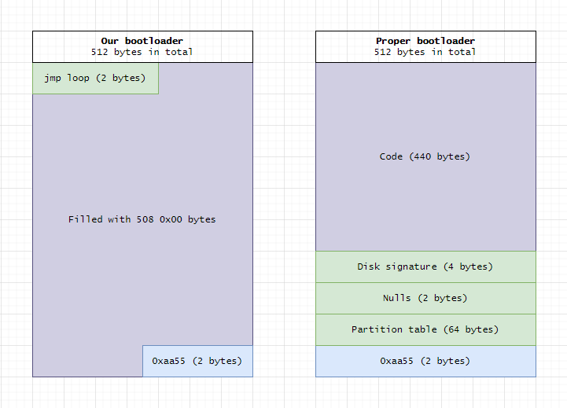
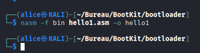
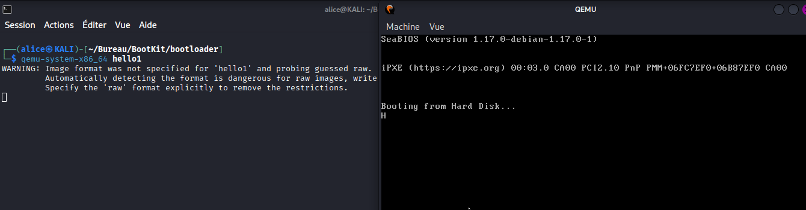
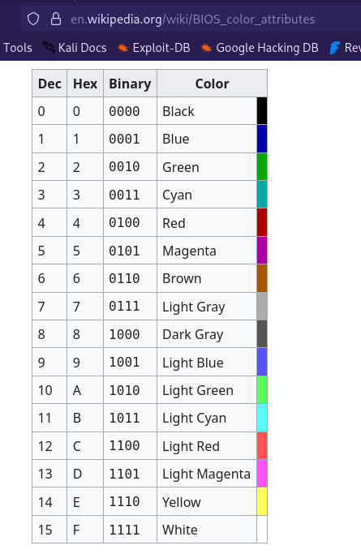
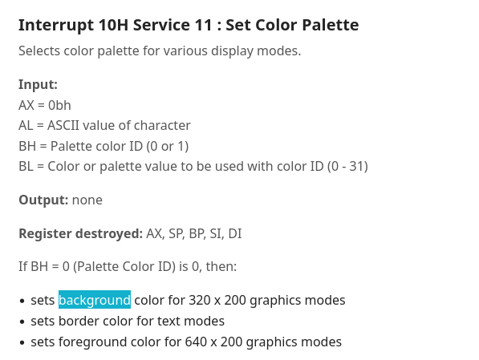
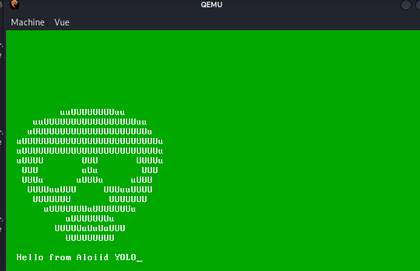

# Boot 16 bits – real mode

dimanche 16 août 2026 00:24


source : https://www.ired.team/miscellaneous-reversing-forensics/windows-kernel-internals/writing-a-custom-bootloader


```asm
bits 16
org 0x7C00
loop:
jmp loop
times 510 ($-$$) db 0; //cette ligne va au début du programme et remplie de 0 jusqu'à la fin du programme
dw 0xaa55
```



How does NASM know it needs to pad the binary with 508 null bytes?

- $ - address of the current instruction - jmp loop (2 bytes)
- $$ - address of the start of our code section - 0x00 when the binary is on the disk

Given the above, times 510 - ($-$$) db 0 reads as - pad the binary with 00 bytes 508 times: 510 - (2-0) = 508.

Un exemple simple qui va afficher HELLO en x86

```asm
;bootloader simple 1


bits 16

[org 0x7C00]

start :

HELLO:

db "HELLO"

mov al, [HELLO]
; si je n'avais pas mis [org 0x7C00] au début, j'aurais pu faire d'abord mov al, HELLO puis add al, 0x7C00 pour ajouter la vrai adresse de HELLO en prenant en compte le point de départ 0x7C00

;on affiche le texte sur l'ecran avec l'interrupteur BIOS

mov ah, 0x0e
int 0x10

;routine de fin

times 510 - ($-$$) db 0 ;on remplis le reste des ostets vide de 0 jusqu'a atteindre 512 octets
dw 0xaa55 ; on met la signature de fin

end :

jmp end ; boucle de fin
```



Première erreur...

Après plusieurs correction voici la version 2 de mon code :

```asm
;bootloader simple 1


bits 16
[org 0x7C00]

start:
mov si, HELLO ; le registre si (esi) pointe sur le début de la chaine
;boucle pour afficher toute la chaine et pas juste le premier caractère
BOUCLE:
lodsb ; registre implicite qui va récupérer la valeur dans esi la mettre dans eax et incrémenter esi donc si esi contient une chaine on va boucler sur cette chaine
cmp al, 0 ; on checke si on a atteint la fin de la chaine (\0)
je end
mov ah, 0x0e ;on affiche le texte sur l'ecran avec l'interrupteur BIOS
int 0x10
jmp BOUCLE
end:
jmp end

HELLO:
db "HELLO", 0

;routine de fin
times 510 - ($-$$) db 0 ;on remplis le reste des ostets vide de 0 jusqu'a atteindre 512 octets
dw 0xaa55 ; on met la signature de fin
```



OK cool !

On va tester maintenant avec des couleurs :






On veut par exemple un fond vert et la couleur du texte en blanc. Dans ce cas-là on mettrais dans bh la couleur : mov bh, 0x2F (2 pour le vert et 15(F) pour le blanc)



```asm
;bootloader simple 3 avec ascii et on change le fond avec les interrupteurs bios

bits 16
[org 0x7C00]


;configurer le background et la couleur
SETBACK:
mov ah, 0x06 ; https://www.ctyme.com/intr/rb-0096.htm
xor al, al ; on efface la fenetre
xor cx, cx ;ligne et colonne sur le coté droit de la fentre on met a 0
mov dx, 0x184f ; définit le coin bas-droit de la zone à effacer à la ligne 0x18 (24) et colonne 0x4f (79)
mov bh, 0x2F ; backround et la couleur du texte (https://en.wikipedia.org/wiki/BIOS_color_attributes) ici on veut que le background soit de couleur verte et que le texte soit en blanc
int 0x10

start:

mov si, ASCII ; on met l'adresse de l'ascii dans si
mov ah, 0x0e

BOUCLE:
lodsb
cmp al, 0
je end
int 0x10
jmp BOUCLE

end:
jmp end

call SETBACK

ASCII: db "          uuUUUUUUUUuu",13,10,"     uuUUUUUUUUUUUUUUUUUuu",13,10,"   uUUUUUUUUUUUUUUUUUUUUUu",13,10,"uUUUUUUUUUUUUUUUUUUUUUUUUUu",13,10,"uUUUUUUUUUUUUUUUUUUUUUUUUUu",13,10," uUUUU       UUU       UUUUu",13,10, "  UUU        uUu        UUU",13,10,"   UUUu      uUUUu     uUUU",13,10,"    UUUUuuUUU    UUUuuUUUU",13,10, "     UUUUUUU       UUUUUUU",13,10, "      uUUUUUUUuUUUUUUUu",13,10,"           uUUUUUUUu",13,10,"        UUUUUuUuUuUUU",13,10,"           UUUUUUUUU",13,10,13,10," Hello from Aloiid YOLO", 0

; routine de fin

times 510 - ($-$$) db 0
dw 0xaa55
```
noice 
