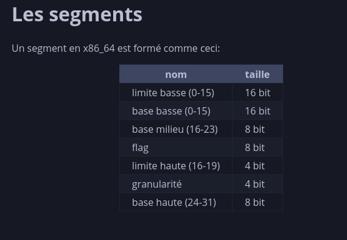
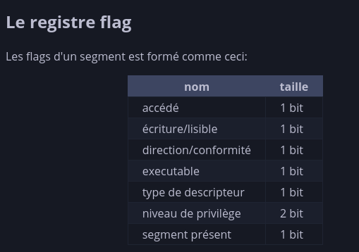
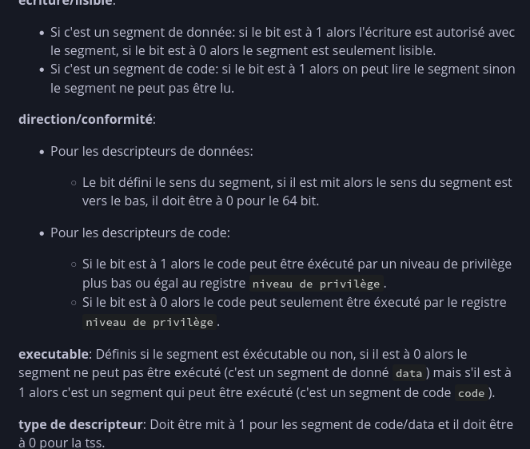
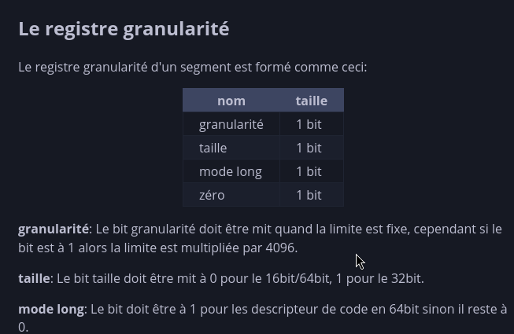
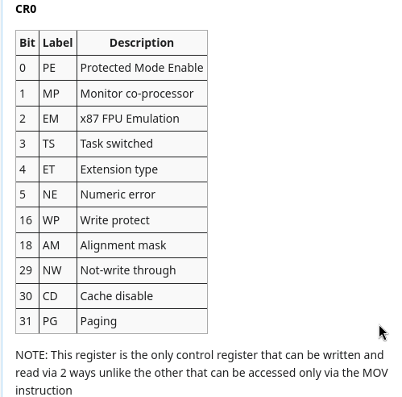
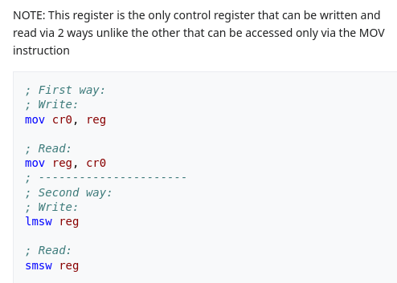
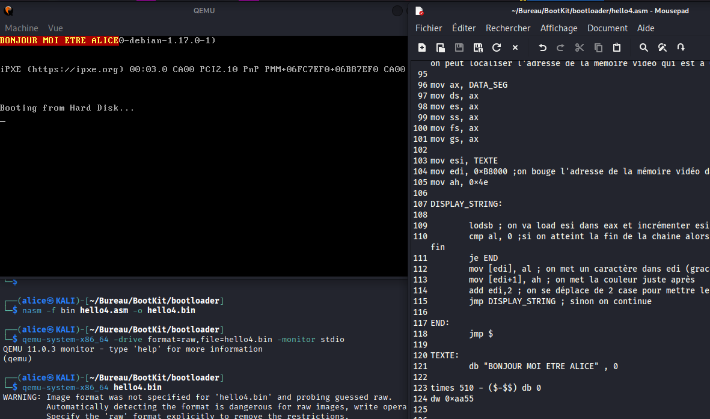
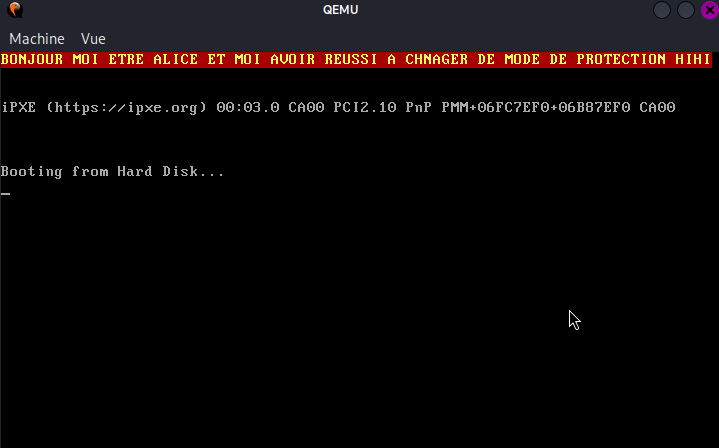

# Boot 32 bits - protected mode

Wednesday, August 19, 2026 8:54 PM

Making an OS (x86) Chapter 6 - Entering Protected mode, GDT

Daedalus Community

Watch on

https://devse.wiki/x86_64/structures/gdt

https://wiki.osdev.org/Drawing_In_a_Linear_Framebuffer

Mode reel (16 bits) et le mode protégé (32 bits)

Le CPU de lancer le BIOS qui lui se trouve dans une puce sur la care mère. Le mode reel permet donc au bios d'executer n'importe quel code n'importe ou sans protection.

Ici on va voir comment on peut passer du mode reel au mode protégé.

On va devoir d'abord configurer le GDT qui est le Global Descriptor Table. C'est ce qui va permettre de définir les regles des segments (descripteurs) en prenant la base (adresse du début du segment), la taille/limite (0xFFFF = 4go) et les droits (écriture/lecture)

On a différent type de management de mémoire :

- Flat memory model
- Segmentation
- Et paging

Ici on va utiliser le flat (plat) car c'est plus simple et le plus utilisé en ce moment. Au lieu de découper la mémoire en plusieurs segment on va juste créer deux segment (code et data) et couvrirent toute la mémoire.

Donc les segments code et data auront la meme base.

Le GDT peut avoir au minimum 3 entrées (descripteur )

Par regle de sécurité, le premier descripteur est nul, je ne sais pas vraiment pourquoi mais c'est une règle de sécurité apparemment.

Ensuite on a le descripteur du code. C'est celui qui va décrire la zone ou se trouve notre code. Il faut qu'il soit exécutable.

Enfin on a le descripteur de données. C'est la ou se trouve nos données (du style db "HELLO"). Il doit etre possible de lire/ecrire dans cette zone.

Pour initialiser tout ça on peut faire le code suivant :












```asm
GDT_start:
dd 0
dd 0
Ou dq 0
(il faut qu'on ai 8 octets de zéro)
;ensuite on définie le descripteur de code
GDT_code :
;on définie la limite d'abord qui sera de 4 go
dw 0xFFFF ;car on nous demande 16 bits donc on utilise un word (2 octets donc 16 bits)
;ensuite on définie la base basse, idem on nous demande un 16 bits donc on utilisera un dw
dw 0x0000 ;2 octets = 16 bits
; ensuite on définie la base millieu (8 bits donc db)
db 0 ;(tester avec db 0x00)
; ensuite on définie le flag (8 bits). On configure le descripteur de code ici. Au début j'avais mis ça : db 0110101 ( en plus j'avais pas vu que la case niveau de privilège attendait 2 bits + que c'était en little endian donc a l'envers. (01011001)
db 10011010
;ensuite on doit définir la limite haute et la granularité. On a plusieurs manières de les définir, on peut le faire en binaire comme ceci :
db 11001111 ou en hexa du moment que ça ne dépasse 4 bits comme ceci db 0xCF avec 12 (1100) et 15 (1111) . De plus on ne peut pas faire deux db séparément sinon ça ferait 8 bits et on veut 4 bits
db 0xCF
; et finito pipo
db 0x00 ; base encore à zéro (byte = 1 octet donc à 8 bits)
;ensuite on définie le descripteur de données
GDT_data:
; C'est quasiment la meme initialisation que le descripteur de code sauf qu'on change 1 bit dans le flag pour la section executable. On veut juste écrire ou lire donc le bit devient 0
;on définie la limite d'abord qui sera de 4 go
dw 0xFFFF ;car on nous demande 16 bits donc on utilise un word (2 octets donc 16 bits)
;ensuite on définie la base basse, idem on nous demande un 16 bits donc on utilisera un dw
dw 0
; ensuite on définie la base millieu (8 bits donc db)
db 0
; ensuite on définie le flag (8 bits). On configure le descripteur de data ici. --> 01001001 en little endian –-> 10010010
db 10010010
db 11001111 ; on définie la limite haute et la granularité.
db 0x00 ; base encore à zéro (byte = 1 octet donc à 8 bits)
; enfin on arrive à la fin
GDT_end:
```

Maintenant pour dire au CPU que notre GDT est le suivant, on doit lui dire ou se situe notre GDT puis la charger avec le registre spécial lgdt (load GDT)

POur ça on va initialiser une structure qui contient la taille de notre GDT et un pointeur vers l'adresse de début du GDT

```asm
GDT_descriptor:
dw GDT-end – GDT_start –1 ; taille limite du GDT (on fait –1 car on compte la position depuis 0 et le dernier indice est toujours = à taille –1)
dd GDT_start ; adresse du début du GDT)
;on va défirnir la distance des deux segments pour les utliser plus tard :
CODE_SEG equ GDT_code – GDT_start ;equ est utilisé pour initialiser des constantes en assembleurs.
DATA_SEG equ GDT_data – GDT_start
```

Maintenant on peut continuer en chargeant notre GDT. POur utiliser un segment on va utiliser un systeme de position avec les distances qu'on a défini dans GDT_descriptor.

On va devoir changer le registre de controle CR0. (control register 0). Contrairement aux registres de travail comme ax ou bx qui servent à manipuler des données, les registres de contrôle configurent le comportement fondamental du processeur. Chacun de leurs bits active ou désactive une fonctionnalité du CPU.




```

Donc le but ici est de changer le bit 0 PE en mode protégé = PE = 1

Tu viens de mettre le bit PE à 1. Techniquement, le CPU est en mode protégé… mais il reste un souci : le registre cs (Code Segment, qui indique quel segment de code on exécute) contient encore une valeur héritée du mode réel. Il pointe vers l'ancien monde 16 bits, pas vers ton segment de code du GDT.

Or en mode protégé, cs ne doit plus contenir une valeur de mode réel : il doit contenir un sélecteur valide qui désigne une entrée du GDT (ton CODE_SEG = 0x08 ). Tant que cs n'est pas rechargé, le CPU est dans un état bâtard : le mode protégé est activé, mais le registre de code pointe au mauvais endroit.

Le jmp CODE_SEG:mode_32 sert à recharger cs avec le bon sélecteur.

```asm
cli ;on va désactiver toutes les interruptions
lgdt [GDT_descriptor] ; on load notre GDT (global descriptor table)
;on modifie le bit 0 du registre CR0 pour passer du real mode au mode protégé et donc on passera en bits 32, d'ou le fait qu'on utilise un registre de 32 bits.
mov eax, cr0
or eax, 1 ;on met seulement le dernier bit à 0 avec or sans toucher aux autres bits
mov cr0, eax ; on remet la valeur modifier dans cr0
; maintenant on est en mode protégé et on configurera le reste en mode bits 32. Il faut maintenant recharger le code segment avec un far jmp. C'est a dire qu'on va sauter vers notre nouveau code segment qu'on a crée (CODE_SEG).

jmp CODE_SEG:start_protected_mode ;on saute avec notre nouveau segment vers une autre destination (ici note segment qu'on a crée sera pris en code et l'adresse de destination donc notre code aura le mode protégé). Donc en gros ici, la procédure start_protected_mode sera en mode protégé et en 32 bits.

[bits 32]
;notre VRAI programme avec l'affichage etc
start_protected_mode:
;ici les interrupteurs ne fonctionnent plus (on a plus le pouvoir sur ça) mais on peut localiser l'adresse de la mémoire vidéo qui est à 0xB8000
mov esi, TEXTE

DISPLAY_STRING:
lodsb ; on va load esi dans eax et incrémenter esi
cmp eax, 0 ; si on atteint la fin de la chaine alors on saute vers la fin
je END
;mov al, TEXTE
mov ax, 0x4e
Mov [0xB8000], ax
jmp DISPLAY_STRING ; sinon on continue


END:
jmp $

TEXTE:
db "BONJOUR MOI ETRE ALICE"
```



Voici le code global :

```asm
bits 16

[org 0x7C00]

start:
jmp passer_en_mode_proteger

;structure GDT ICI !
GDT_start:

dd 0
dd 0

;Ou dq 0
;(il faut qu'on ai 8 octets de zéro)
;ensuite on définie le descripteur de code

GDT_code :

;on définie la limite d'abord qui sera de 4 go
dw 0xFFFF ;car on nous demande 16 bits donc on utilise un word (2 octets donc 16 bits)

;ensuite on définie la base basse, idem on nous demande un 16 bits donc on utilisera un dw
dw 0x0000 ;2 octets = 16 bits

; ensuite on définie la base millieu (8 bits donc db)
db 0 ;(tester avec db 0x00)

; ensuite on définie le flag (8 bits). On configure le descripteur de code ici. Au début j'avais mis ça : db 0110101 ( en plus j'avais pas vu que la case niveau de privilège attendait 2 bits + que c'était en little endian donc a l'envers. (01011001)
db 10011010b

;ensuite on doit définir la limite haute et la granularité. On a plusieurs manières de les définir, on peut le faire en binaire comme ceci :
db 11001111b ;ou en hexa du moment que ça ne dépasse 4 bits comme ceci db 0xCF avec 12 (1100) et 15 (1111) . De plus on ne peut pas faire deux db séparément sinon ça ferait 8 bits et on veut 4 bits

; et finito pipo
db 0x00 ; base encore à zéro (byte = 1 octet donc à 8 bits)

;ensuite on définie le descripteur de données
GDT_data:

; C'est quasiment la meme initialisation que le descripteur de code sauf qu'on change 1 bit dans le flag pour la section executable. On veut juste écrire ou lire donc le bit devient 0

;on définie la limite d'abord qui sera de 4 go
dw 0xFFFF ;car on nous demande 16 bits donc on utilise un word (2 octets donc 16 bits)

;ensuite on définie la base basse, idem on nous demande un 16 bits donc on utilisera un dw
dw 0

; ensuite on définie la base millieu (8 bits donc db)
db 0

; ensuite on définie le flag (8 bits). On configure le descripteur de data ici. --> 01001001 en little endian –-> 10010010
db 10010010b

db 11001111b ; on définie la limite haute et la granularité.
db 0x00 ; base encore à zéro (byte = 1 octet donc à 8 bits)
; enfin on arrive à la fin
GDT_end:

GDT_descriptor:

dw GDT_end - GDT_start - 1 ; taille limite du GDT (on fait –1 car on compte la position depuis 0 et le dernier indice est toujours = à taille –1)
dd GDT_start ; adresse du début du GDT)

;on va défirnir la distance des deux segments pour les utliser plus tard :
CODE_SEG equ GDT_code - GDT_start ;equ est utilisé pour initialiser des constantes en assembleurs.
DATA_SEG equ GDT_data - GDT_start

;-----------------------------------------
passer_en_mode_proteger:

cli ;on va désactiver toutes les interruptions
lgdt [GDT_descriptor] ; on load notre GDT (global descriptor table)

;on modifie le bit 0 du registre CR0 pour passer du real mode au mode protégé et donc on passera en bits 32, d'ou le fait qu'on utilise un registre de 32 bits.
mov eax, cr0
or eax, 1 ;on met seulement le dernier bit à 0 avec or sans toucher aux autres bits
mov cr0, eax ; on remet la valeur modifier dans cr0

; maintenant on est en mode protégé et on configurera le reste en mode bits 32. Il faut maintenant recharger le code segment avec un far jmp. C'est a dire qu'on va sauter vers notre nouveau code segment qu'on a crée (CODE_SEG).

jmp CODE_SEG:start_protected_mode ;on saute avec notre nouveau segment vers une autre destination (ici note segment qu'on a crée sera pris en code et l'adresse de destination donc notre code aura le mode protégé). Donc en gros ici, la procédure start_protected_mode sera en mode protégé et en 32 bits.

[bits 32]

;notre VRAI programme avec l'affichage etc

start_protected_mode:
;ici les interrupteurs ne fonctionnent plus (on a plus le pouvoir sur ça) mais on peut localiser l'adresse de la mémoire vidéo qui est à 0xB8000

mov ax, DATA_SEG ; on initialise les registres de segment avec notre nouveau data segment
mov ds, ax
mov es, ax
mov ss, ax
mov fs, ax
mov gs, ax

mov esi, TEXTE
mov edi, 0xB8000 ;on bouge l'adresse de la mémoire vidéo dans edi
mov ah, 0x4e

DISPLAY_STRING:

lodsb ; on va load esi dans eax et incrémenter esi
cmp al, 0 ;si on atteint la fin de la chaine alors on saute vers la fin
je END
mov [edi], al ; on met un caractère dans edi (grace à lodsb)
mov [edi+1], ah ; on met la couleur juste après
add edi,2 ; on se déplace de 2 case pour mettre le caractère suivant
jmp DISPLAY_STRING ; sinon on continue

END:
jmp $

TEXTE:
db "BONJOUR MOI ETRE ALICE ET MOI AVOIR REUSSI A CHNAGER DE MODE DE PROTECTION HIHI" , 0
times 510 - ($-$$) db 0
dw 0xaa55
```


