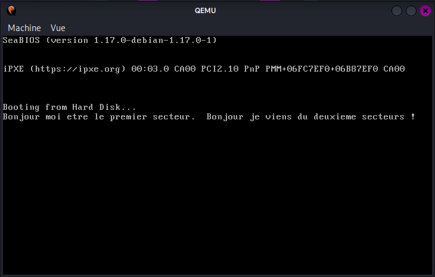

# Boots 16 – allez plus loin que 512 octets

Thursday, August 20, 2026 9:48 PM

source : http://3zanders.co.uk/2017/10/16/writing-a-bootloader2/**



```asm
; load more disk

bits 16

[org 0x7C00]

start:

mov [disk], dl ;numéro du disque dans dl

xor ax, ax
mov ds, ax
mov es, ax
mov ss, ax
mov fs, ax
mov gs, ax

init_sector2:

mov ah, 0x2 ; fonction pour lire les secteurs
mov al, 1 ;le secteur qu'on souhaite lire
mov ch, 0 ; cylinder idx ??
mov dh, 0; tete d'idx
mov cl, 2 ; sector idx
mov dl, [disk] ; disk idx, ici le numero du disque est automatiquement mis dans dl
mov bx, 0x7E00; target pointeur  ou 0x7E00
int 0x13 ;on call l'interruption BIOS

sector1:

mov si, HELLO_FIRST_SECTOR


DISPLAY_STRING:
lodsb
cmp al, 0
je vers_secteur2
mov ah, 0x0e
int 0x10
jmp DISPLAY_STRING

vers_secteur2:
jmp sector2


;donnée du secteur 1
disk: db 0
HELLO_FIRST_SECTOR:
db "Bonjour moi etre le premier secteur. ", 0

times 510-($-$$) db 0
dw 0xaa55


;--------------------deuxieme secteurs-------------------

sector2:

mov si, HELLO_NEXT_SECTOR

DISPLAY_STRING2:
lodsb
cmp al, 0
je END
mov ah, 0x0e
int 0x10
jmp DISPLAY_STRING2

END:
jmp $

HELLO_NEXT_SECTOR:
db " Bonjour je viens du deuxieme secteurs ! " , 0

times 1024-($-$$) db 0
```
