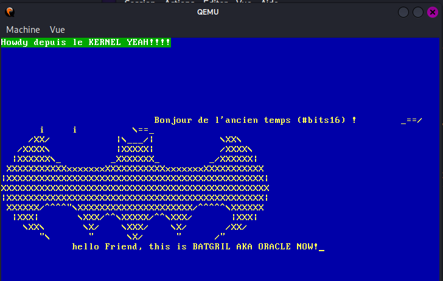

# Boots – kernel – test 3 - batman




## Boot.asm

```asm
;boot.asm
section .boot
bits 16
global boot

boot:

;ce programme fait office de pont entre le bootloader et le kernel

mov [disk], dl ; on récupère le numéro du disk pour le secteur 2

xor ax, ax
mov ds, ax
mov ss, ax
mov es, ax
mov fs, ax
mov gs, ax
mov sp, 0x7C00
jmp init_noyau

init_noyau:

mov ah, 0x2
mov al, 20
mov ch, 0
mov dh, 0
mov cl, 2
mov dl, [disk]
mov bx, 0x7E00
int 0x13

;------------affichage du premier secteur-------------------

sector1:

mov si, hello1
mov ah, 0x0e

affichage1:

lodsb
cmp al, 0
je 0x7E00
int 0x10
jmp affichage1

hello1: db "Bonjour de l'ancien temps ! ", 0

;init du disk
disk : db 0

times 510 - ($-$$) db 0
dw 0xaa55
```

## Ascii.asm

```asm
;ascii.asm
section .text
bits 16
global stage2
extern _start

stage2:
call SETBACKGROUND
mov si, hello1
mov ah, 0x0e
call affichage_ascii
mov si, ASCII
mov ah, 0x0e
call affichage_ascii
jmp init_mode_protege

affichage_ascii:
lodsb
cmp al, 0
je fin_affichage
int 0x10
jmp affichage_ascii

fin_affichage:
ret

;configurer le background et la couleur
SETBACKGROUND:
mov ah, 0x06 ; https://www.ctyme.com/intr/rb-0096.htm
xor al, al ; on efface la fenetre
xor cx, cx ;ligne et colonne sur le coté droit de la fentre on met a 0
mov dx, 0x184f ; définit le coin bas-droit de la zone à effacer à la ligne 0x18 (24) et colonne 0x4f (79)
mov bh, 0x1E ; backround et la couleur du texte
int 0x10
ret

init_mode_protege:

cli
lgdt [GDT_descriptor]
mov eax, cr0
or eax, 1
mov cr0, eax
jmp CODE_SEG:jmp_protected_mode ; long jmp vers le protected mode

;---------GDT INITIALISATION---------------------

GDT_start:
dq 0

GDT_code:
dw 0xFFFF
dw 0x0000 ;2 octets = 16 bits
db 0
db 10011010b
db 11001111b
db 0x00

GDT_data:
dw 0xFFFF
dw 0
db 0
db 10010010b
db 11001111b
db 0x00

GDT_end:

GDT_descriptor:

dw GDT_end - GDT_start -1 ; taille limite
dd GDT_start ; @ du début de la structure GDT
CODE_SEG equ GDT_code - GDT_start ; initialisation des constantes code seg
DATA_SEG equ GDT_data - GDT_start ; initialisaton de la constantes data seg

bits 32

jmp_protected_mode:
jmp _start

hello1: db "Bonjour de l'ancien temps (#bits16) ! ", 0

ASCII:
db '       _==/          i     i          \==_', 13,10
db '     /XX/            |\___/|            \XX\', 13,10
db '   /XXXX\            |XXXXX|            /XXXX\', 13,10
db ' |XXXXXX\_         _XXXXXXX_         _/XXXXXX|', 13,10
db ' XXXXXXXXXXXxxxxxxxXXXXXXXXXXXxxxxxxxXXXXXXXXXXX', 13,10
db '|XXXXXXXXXXXXXXXXXXXXXXXXXXXXXXXXXXXXXXXXXXXXXXX|', 13,10
db 'XXXXXXXXXXXXXXXXXXXXXXXXXXXXXXXXXXXXXXXXXXXXXXXXX', 13,10
db '|XXXXXXXXXXXXXXXXXXXXXXXXXXXXXXXXXXXXXXXXXXXXXXX|', 13,10
db ' XXXXXX/^^^^', 34, '\XXXXXXXXXXXXXXXXXXXXX/^^^^^\XXXXXX', 13,10
db ' |XXX|       \XXX/^^\XXXXX/^^\XXX/       |XXX|', 13,10
db '    \XX\       \X/    \XXX/    \X/       /XX/', 13,10
db '       ', 34, '\       ', 34, '      \X/      ', 34, '      /', 34, 13,10
db "             hello Friend, this is BATGRIL AKA ORACLE NOW!", 0
db 0
```

## Entry.asm

```asm
;entry.asm

section .text
bits 32
global _start
extern kernel_main

DATA_SEG equ 0x10

;call du kernel
_start:
mov ax, DATA_SEG
mov ds, ax
mov ss, ax
mov es, ax
mov fs, ax
mov gs, ax
mov esp, kernel_stack_top
call kernel_main
cli

.hang:
hlt
jmp .hang

section .bss
align 4
kernel_stack_bottom: equ $
resb 16384
kernel_stack_top :
```

## Kernel_main.c

```c
//petit kernel en C

void kernel_main (void) {

//volatile tells the compiler not to optimize anything that has to do with the volatile variable.
//source : https://stackoverflow.com/questions/246127/why-is-volatile-needed-in-c
//le short contient 2 octets donc il aurait fallu trouver une autre manière de rmleplir le tableau. On va
//donc prendre le char qui fait un seul octets

volatile char * vga = (volatile char *) 0XB8000;
const char couleur = 0x2F;
const char * msg = "Howdy depuis le KERNEL YEAH!!!!";
//int msgTaille = strlen(msg) - 1;

int i = 0;
int j = 0;

//on rentre dnas la boucle pour afficher le message

while(msg[i] != 0){

vga[j] = msg[i];
vga[j+1] = couleur;
i++;
j = j + 2;

}

//on fait une boucle à l'infini pour éviter que le noyau ne s'arrete.

while (1) {

//rien ici

}
}
```

## Linker.ld

```ld
ENTRY(boot)
OUTPUT_FORMAT("binary")
SECTIONS {
    . = 0x7c00;

    .boot :
    {
        *(.boot)
    }

    . = 0x7E00;          /* ← force explicitement stage2 à 0x7E00 */

    .text :
    {
        ascii.o(.text)      /* l'ASCII art en premier (à 0x7E00) */
        entry.o(.text)      /* puis on jmp vers le pont */
        *(.text)            /* et enfin le kernel s'exécute*/
    }

    .rodata :
    {
        *(.rodata)
    }

    .data :
    {
        *(.data)
    }

    .bss :
    {
        *(.bss)
    }
}
```

#cringe
